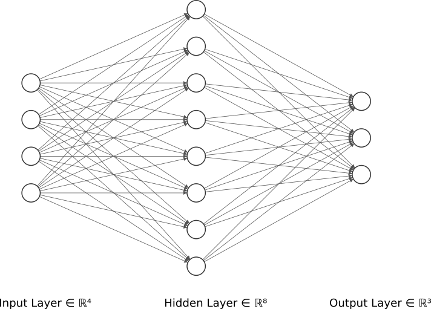

# Keras Iris
A simple model to classify the iris dataset with keras.



Graphic generated with [NN-SVG](http://alexlenail.me/NN-SVG/index.html) made by [Alex Lenail](http://alexlenail.me/).

## How to run
Download the dataset.
```sh
wget http://archive.ics.uci.edu/ml/machine-learning-databases/iris/iris.data
```

Install the required libraries with pip.
```sh
pip install -r requirements.txt
```

Run the python script.
```sh
python .
```

## Output
```
Evaluating model...
12/12 [==============================] - 0s 2ms/step
loss: 4.5200206955087197e-07 - accuracy: 1.0
12/12 [==============================] - 0s 73us/step
loss: 6.109480068516859e-07 - accuracy: 1.0
12/12 [==============================] - 0s 68us/step
loss: 4.6193619596124336e-07 - accuracy: 1.0
12/12 [==============================] - 0s 64us/step
loss: 5.265079039418197e-07 - accuracy: 1.0
12/12 [==============================] - 0s 65us/step
loss: 1.053017626873043e-06 - accuracy: 1.0
12/12 [==============================] - 0s 58us/step
loss: 9.586436817698996e-07 - accuracy: 1.0
```
